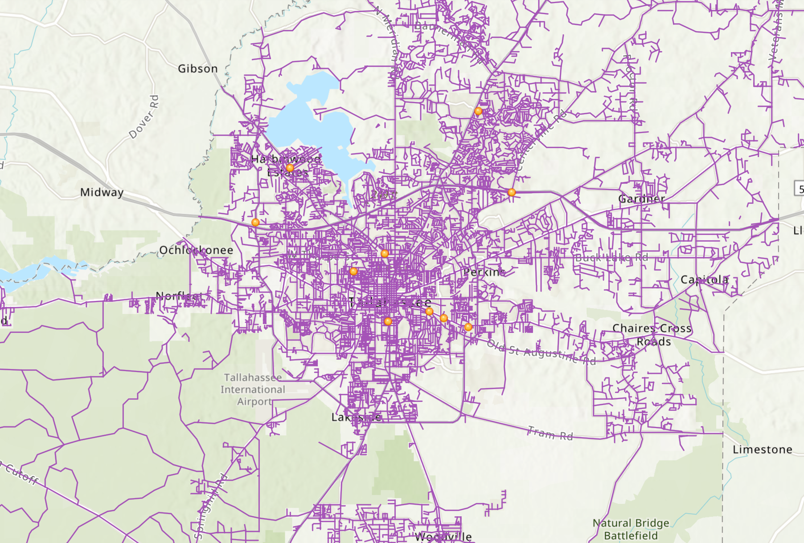

## Portfolio

---

### Projects 

[Inverse Distance Weighted Map of Texas Mesonet Stations](/sample_page)

---
[Cluster Analysis of Crime Density in Chicago, IL](/pdf/sample_presentation.pdf)

---
[Accessibility to Grocery Stores in the City of Los Angeles, CA](/pdf/mengle_term_project_report.pdf)

---

---

### Earth Engine Projects

- [Burned Area Before and After a Fire in Northern California](https://karissamengle.users.earthengine.app/view/burnedarea)

---

---

Page template forked from <a href="https://github.com/evanca/quick-portfolio">evanca</a>

<!-- Remove above link if you don't want to attibute -->
